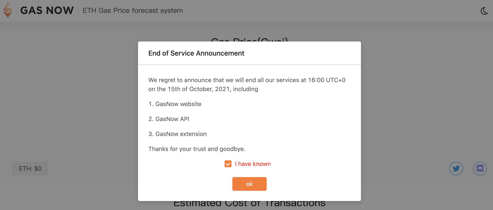
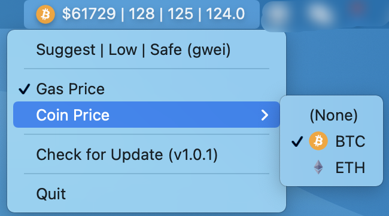

# In memory of GasNow

# Installation

**Currently only available for MacOS system**

1. Go to [Releases](https://github.com/cyhhao/gasless/releases) to download the latest version
2. Unzip it
3. Drag gasless.app into Application or double-click to open directly

# Features

- Real-time display of ETH gas price, updated every 5 seconds
- Currency price display, updated every minute (currently only supports BTC/ETH)

# Todo

- Support gas price for more chains
- Support more currency prices, including custom currencies
- Welcome to raise more [issues](https://github.com/cyhhao/gasless/issues) ...

# Thanks

- [GasNow](https://www.gasnow.org/)
- [BlockNative](https://www.blocknative.com/gas-estimator)
- [CoinGecko](https://coingecko.com)
